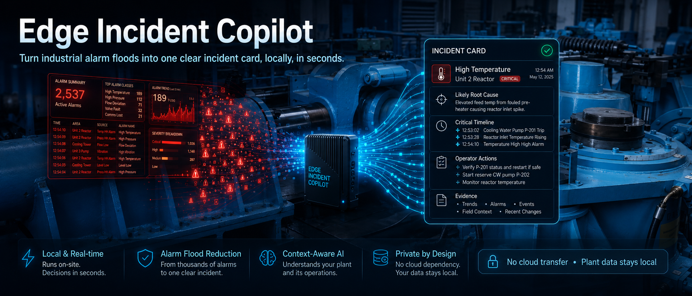
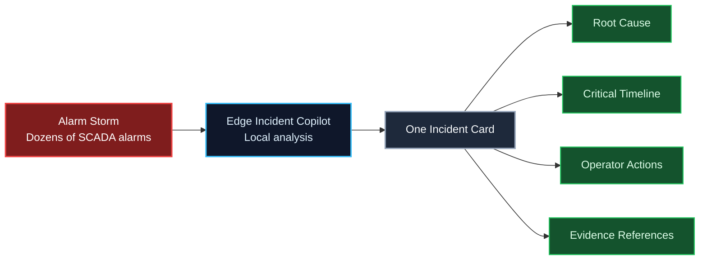
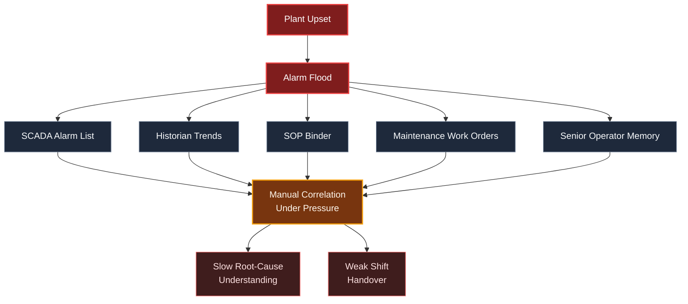
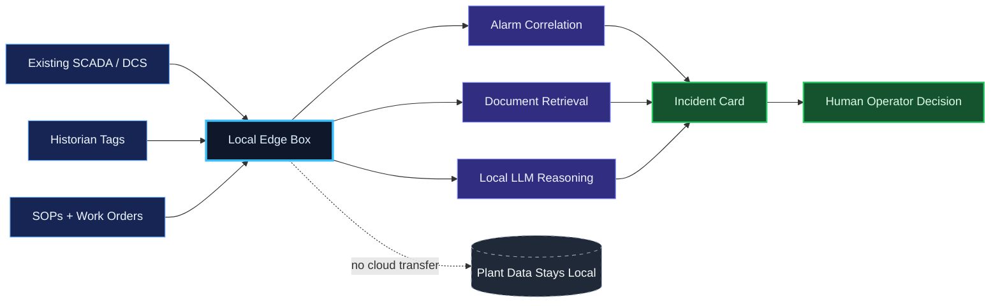
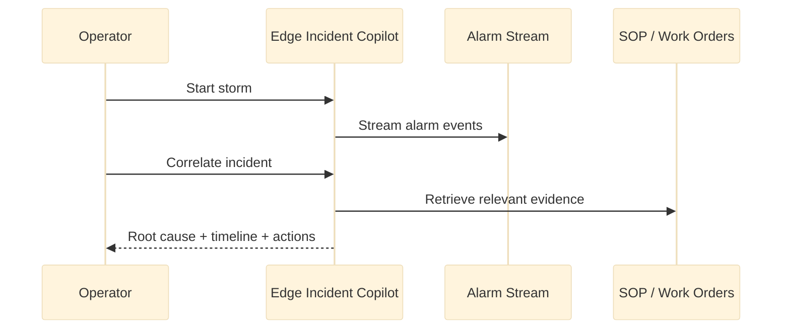

<p align="center">
  
</p>

<p align="center">
  <a href="https://chunkai4u.github.io/edge-incident-copilot/"><b>▶ Try the live demo</b></a>
</p>

# Edge Incident Copilot

**Turn industrial alarm floods into one clear incident card, locally, in seconds.**

Edge Incident Copilot is an offline demo for control rooms in energy, water, and other critical infrastructure facilities. When a plant upset creates dozens of alarms at once, the copilot helps operators understand what likely happened, what matters first, and what actions should be considered next, without sending plant data to the cloud.

## What

Industrial operators already have SCADA and DCS systems that show alarms. The problem is that these systems usually show the flood, not the story.

Edge Incident Copilot sits on top of existing control-room systems and turns raw alarm streams into one operator-ready incident card:

1. One likely root-cause hypothesis.
2. One critical timeline of what happened.
3. Recommended operator actions.
4. Evidence references from SOPs, work orders, or past incidents.
5. A simple summary that can be used for shift handover or incident review.

It is not an autonomous controller. It is an advisory layer. The human operator stays in control.



## Who

This project is built for facilities where downtime, safety, and data isolation matter.

1. Power plant control rooms.
2. Water and wastewater utilities.
3. Industrial sites with strict cybersecurity and data-sovereignty rules.
4. Operators who already use SCADA, DCS, historians, SOPs, and maintenance systems, but still need faster incident understanding during stressful plant upsets.

The product is designed as a last-mile cognition layer. It does not replace Honeywell, Emerson, ABB, Yokogawa, or other industrial control systems. It reads from them, connects the dots, and presents a clearer incident view for the operator.

## Pain

During a real plant upset, the first problem is not always the loudest alarm. A single physical failure can trigger many downstream alarms within seconds.

Today, operators often have to mentally connect several separate sources at once:

1. SCADA alarm lists show what is ringing now.
2. Historian screens show how values changed over time.
3. SOP documents explain what should be done.
4. Work orders show known maintenance risk.
5. Senior operators provide context from experience.

That creates delay and uncertainty at exactly the moment when clarity matters most.



## Why Now

This product direction is becoming practical now because three changes are happening at the same time.

1. Small local LLMs can run close to the plant network instead of relying on cloud inference.
2. Retrieval systems can connect live alarms to SOPs, work orders, and past incidents.
3. Critical infrastructure operators face stronger expectations around data isolation, cybersecurity, and operational resilience.

The result is a new opportunity: help operators make sense of plant incidents faster while keeping sensitive operational data inside the facility.



## Proof

This repository contains a working offline demo.

1. The main demo is a single self-contained HTML file.
2. The default stage scenario runs without installation or internet access.
3. If Ollama is available locally, the demo can call a local LLM.
4. If no local LLM is available, the demo still works using a deterministic built-in result.
5. A dataset mode is included using public industrial control systems benchmark data from HAI 21.03.

The HAI dataset mode shows that the pipeline can convert real industrial time-series benchmark data into SCADA-style alarms. The SOP and work-order evidence in this repository is synthetic demo context, not customer documentation.



## Demo Scenario

<p align="center">
  
</p>

The default demo shows a realistic combined-cycle power plant incident: **cooling water pump failure leading to turbine trip**.

1. Cooling water pump `CWP-2` trips on motor overcurrent.
2. Cooling water pressure drops.
3. Lube oil and bearing temperatures rise.
4. Shaft vibration becomes critical.
5. The turbine trips and a cascade of downstream alarms follows.

The key moment is that a deferred maintenance work order had already flagged `CWP-2` as risky. The copilot surfaces that evidence inside the incident card instead of leaving it buried in maintenance history.

## How To Run

Open the demo directly:

```bash
open alarm_storm_demo.html
```

Then run the demo flow:

1. Click **Start Storm**.
2. Wait for the alarm flood to stream in.
3. Click **Correlate Incident**.
4. Review the incident card.

No install is required for the default demo.

## Optional Local LLM

If Ollama is running locally, the demo can call it:

```bash
ollama serve
ollama pull llama3.1
```

The demo is still usable without Ollama.

## Optional Dataset Mode

`alarms_dataset.js` is already generated from HAI 21.03 data.

To enable dataset mode, open `alarm_storm_demo.html` and uncomment this line near the bottom:

```html
<!-- <script src="alarms_dataset.js"></script> -->
```

Then reload the page. For more detail, see [`README_DATASET.md`](README_DATASET.md).

## Repository Contents

1. `alarm_storm_demo.html` is the single-file offline demo UI.
2. `dataset_to_alarms.py` converts public ICS CSV data into SCADA-style alarms.
3. `alarms_dataset.js` is the generated HAI dataset alarm stream.
4. `alarms_dataset.json` is the JSON version of the generated alarm stream.
5. `README_DATASET.md` explains dataset mode and limitations.
6. `DEMO_IDEA.md` contains supporting product and demo notes.

## Current Status

This is a pre-pilot demo. It proves the workflow, the operator experience, and the offline architecture.

The next step is a controlled pilot with a real facility using its own alarm exports, historian tags, SOPs, and maintenance records.
